# LHTask — Architektur & Funktionsweise

> Visualisierung der `lhtask`-Plugin-Mechanik in voller Tiefe. Alle Diagramme sind
> [Mermaid](https://mermaid.js.org/) und rendern direkt auf GitHub — keine externen Bilder.

Inhalt:

1. [Zwei Welten: Plugin-Repo vs. Ziel-Repo](#1-zwei-welten-plugin-repo-vs-ziel-repo)
2. [System-Überblick](#2-system-überblick)
3. [Der Lebenszyklus einer Idee](#3-der-lebenszyklus-einer-idee)
4. [Das `post-commit`-Routing](#4-das-post-commit-routing)
5. [Die Kette als Sequenz (Plan → Implement → Review)](#5-die-kette-als-sequenz)
6. [Worktree-Isolation der Implement-Stage](#6-worktree-isolation-der-implement-stage)
7. [Datei-Lebenszyklus & die Skip-Konvention](#7-datei-lebenszyklus--die-skip-konvention)
8. [Schleifen-Sicherheit (warum es nicht rekursiv explodiert)](#8-schleifen-sicherheit)
9. [Locking & Detached-Ausführung](#9-locking--detached-ausführung)
10. [Bootstrap: wie die Kette in ein Repo kommt](#10-bootstrap)
11. [Konfiguration als einzige Wahrheitsquelle](#11-konfiguration)

---

## 1. Zwei Welten: Plugin-Repo vs. Ziel-Repo

Das Wichtigste zuerst — der mentale Bruch, ohne den nichts Sinn ergibt:
**Die Skripte in `templates/` laufen hier nie.** Es sind parametrisierte Vorlagen, die
`bootstrap` per `cp -n` in ein *anderes* Repo kopiert. Erst dort laufen sie als git-Hook.

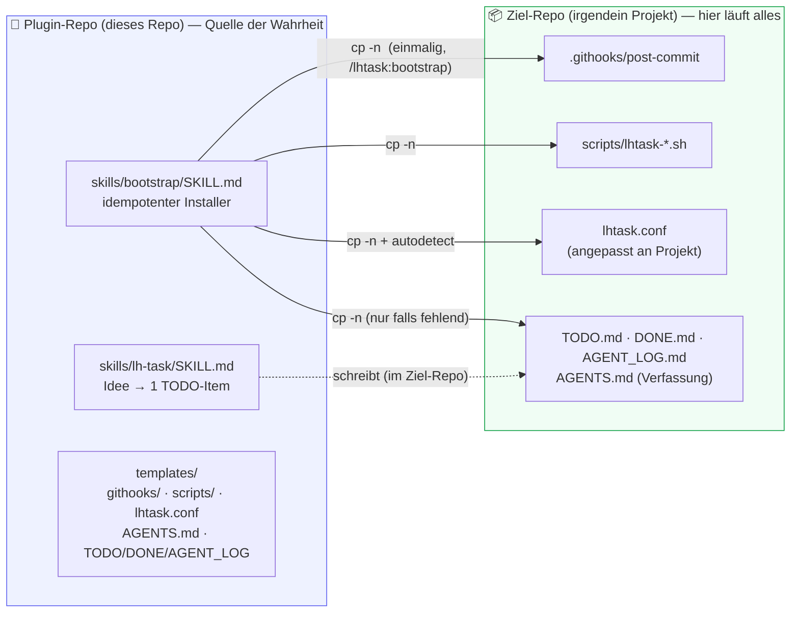

> Konsequenz: Ein Skript hier zu ändern, beeinflusst **jedes künftig gebootstrappte Repo** —
> aber **nicht** die git-Aktivität dieses Repos selbst.

---

## 2. System-Überblick

Zwei Einstiegspunkte (Skills, vom Menschen aufgerufen) und eine dreistufige Kette
(Hooks, vom Commit ausgelöst).

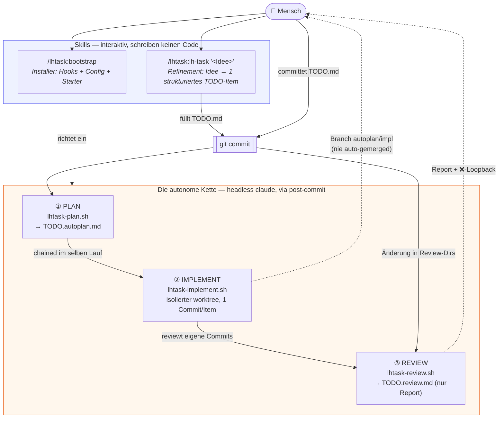

---

## 3. Der Lebenszyklus einer Idee

Von der vagen Notiz bis zum reviewten Branch — der „Happy Path“ aus Nutzersicht.

```mermaid
flowchart LR
    A["💡 vage Idee"] --> B["/lhtask:lh-task"]
    B --> C{"Frage oder<br/>Aufgabe?"}
    C -- "Frage" --> C1["aus Code beantworten"]
    C -- "Aufgabe" --> D["am echten Code erden<br/>(codegraph / Grep)"]
    D --> E["Risiko-Tier + Scope<br/>+ Done-Kriterium klären"]
    E --> F["1 strukturiertes Item<br/>in TODO.md"]
    F --> G[["git commit TODO.md"]]
    G --> H["① PLAN → TODO.autoplan.md"]
    H --> I["② IMPLEMENT<br/>(worktree, autoplan/impl)"]
    I --> J{"Risiko?"}
    J -- "hoch" --> K["🚧 Deferred<br/>(Mensch entscheidet)"]
    J -- "low/med" --> L{"Test grün?"}
    L -- "✅" --> M["1 Commit:<br/>Code + TODO→DONE + LOG"]
    L -- "❌" --> N["Code verwerfen<br/>→ 🚧 Deferred + Grund"]
    M --> O["③ REVIEW des Branches<br/>→ TODO.review.md"]
    O --> P{"Mensch:<br/>mergen?"}
    P -- "ja" --> Q["merge autoplan/impl"]
    P -- "nein" --> R["verwerfen"]

    style K fill:#fef2f2,stroke:#dc2626
    style M fill:#f0fdf4,stroke:#16a34a
    style Q fill:#f0fdf4,stroke:#16a34a
```

---

## 4. Das `post-commit`-Routing

Der Hook ist der Dispatcher. Er entscheidet anhand der **geänderten Dateien** im Commit,
welche Stage(s) laufen — und steigt bei Agent-Commits / Killswitch sofort aus.

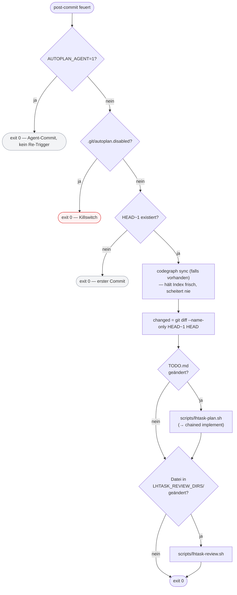

> Das Review-Regex wird dynamisch aus der Config gebaut:
> `review_re="^(${LHTASK_REVIEW_DIRS// /|})/"` → aus `"src tests"` wird `^(src|tests)/`.

---

## 5. Die Kette als Sequenz

Der vollständige Ablauf eines `TODO.md`-Commits über alle Akteure hinweg — inklusive
der Selbst-Review der autonomen Arbeit.

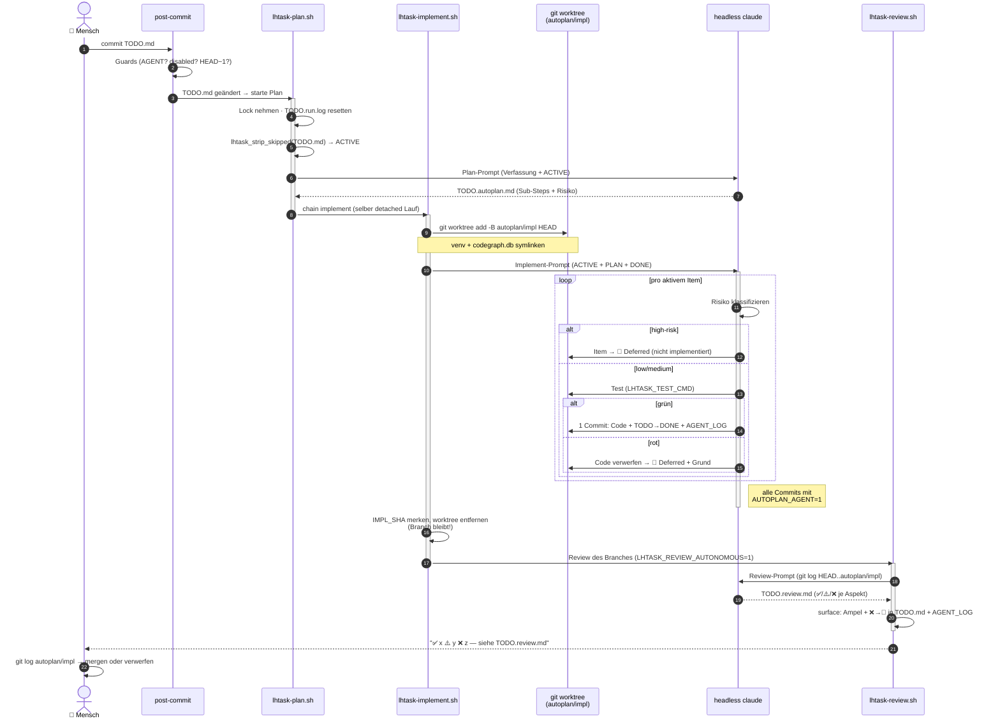

---

## 6. Worktree-Isolation der Implement-Stage

Warum die Implement-Stage **nie** den Arbeitsbaum berührt: Sie arbeitet in einem
wegwerfbaren `git worktree` auf einem eigenen Branch.

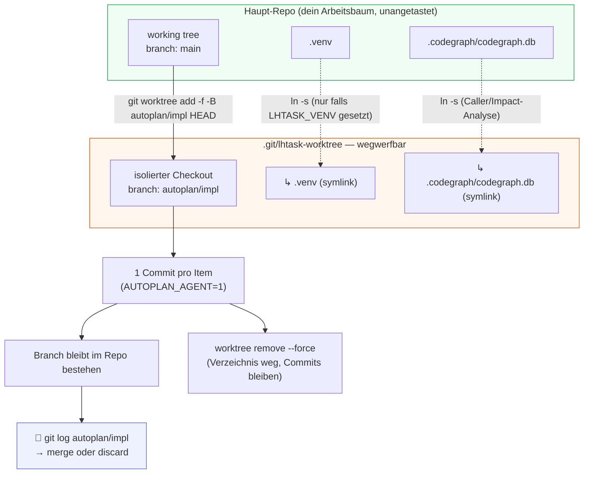

> **Vor** dem Anlegen wird hart aufgeräumt (`worktree remove --force` → `rm -rf` →
> `worktree prune`), damit eine verwaiste Registrierung eines abgebrochenen Laufs den
> neuen `worktree add` nicht blockiert.

---

## 7. Datei-Lebenszyklus & die Skip-Konvention

Welche Datei was bedeutet — und wie der Mensch mit drei Markierungen steuert, was die
Kette anfasst. `lhtask_strip_skipped` filtert vor jeder Plan-/Implement-Stage.

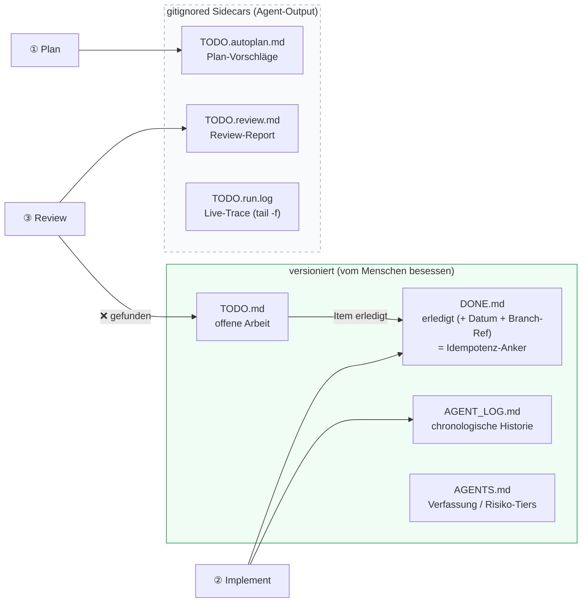

**Die Skip-Konvention in `TODO.md`** — was Plan/Implement **ignorieren**:

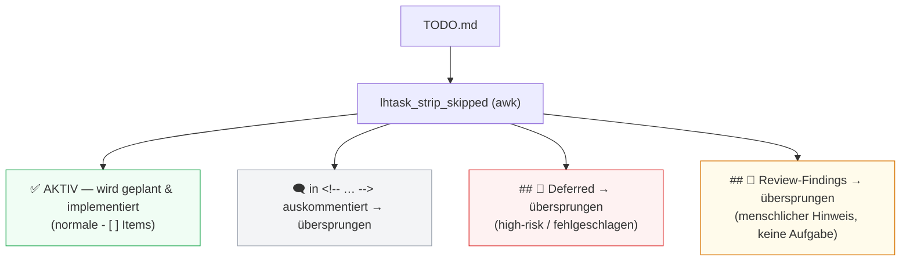

> Hebel für „nur dieses eine Item bearbeiten“: die anderen aktiven Items in einen
> `<!-- … -->`-Block oder unter `## 🚧 Deferred` verschieben.

---

## 8. Schleifen-Sicherheit

Die Kette committet selbst — und jeder Commit feuert wieder `post-commit`. Ohne Schutz
wäre das eine Endlosschleife. Der Schutz ist eine einzige Umgebungsvariable.

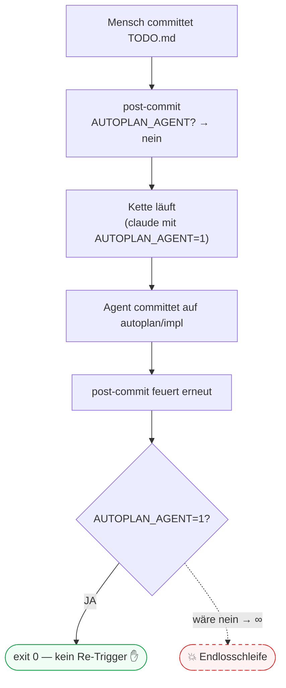

Zwei weitere Konsequenzen derselben Variable:

- Weil Agent-Commits den Hook überspringen, kann er die autonome Arbeit **nicht** selbst
  reviewen → deshalb ruft `lhtask-implement.sh` die Review-Stage am Ende **selbst** auf.
- Auch Plan- und Review-Stage setzen `AUTOPLAN_AGENT=1` defensiv, damit jede git-Aktivität
  von innen heraus nicht rekursiert.

---

## 9. Locking & Detached-Ausführung

Jede Stage ist nebenläufigkeits-sicher und blockiert den Commit nicht.

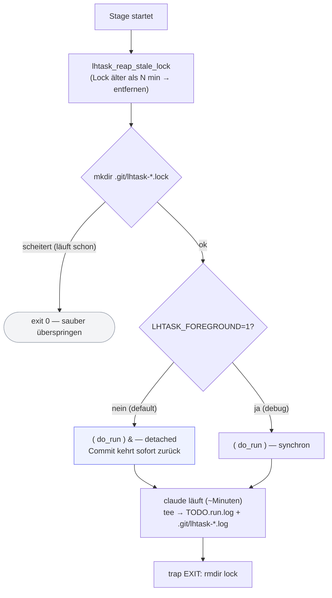

- `mkdir` als atomares Lock (ein Lauf gewinnt; Nebenläufer steigen sauber aus).
- `reap_stale_lock` verhindert, dass ein gekillter Lauf die Kette permanent blockiert.
- **Detached by default** → der Commit kehrt sofort zurück, ein Platzhalter landet sofort
  im Sidecar. `LHTASK_FOREGROUND=1` ist der Debug-/Test-Hebel (synchron).

---

## 10. Bootstrap

Wie die Kette einmalig in ein Repo eingebaut wird — idempotent, nichts wird stillschweigend überschrieben.

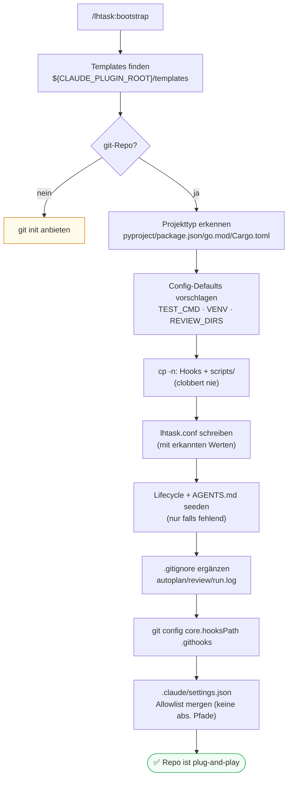

---

## 11. Konfiguration

`lhtask.conf` ist die **einzige Wahrheitsquelle**. Achtung: die Defaults sind an drei
Stellen dupliziert, die synchron bleiben müssen.

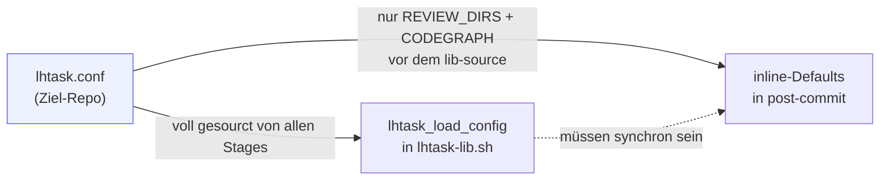

| Key | Bedeutung |
| --- | --- |
| `LHTASK_REVIEW_DIRS` | Dirs, deren Änderung die Review-Stage triggert (z. B. `src tests`) |
| `LHTASK_TEST_CMD` | Test, der grün sein muss; `{path}` → vom Agent gewähltes Ziel |
| `LHTASK_CONSTITUTION_FILES` | Dateien, die jede Stage zuerst liest (default `AGENTS.md`) |
| `LHTASK_IMPL_BRANCH` | Branch der Implement-Stage (default `autoplan/impl`) |
| `LHTASK_VENV` | venv, das in den worktree gesymlinkt wird (Python); leer für Node/Go |
| `LHTASK_CODEGRAPH` | `auto` \| `on` \| `off` |
| `LHTASK_MODEL` | Modell-Override für headless-Läufe (leer = default) |
| `LHTASK_REVIEW_AUTONOMOUS` | `1` = auch die impl-Branch-Commits reviewen |
| `LHTASK_NOTIFY` | `1` = Desktop-Notification bei Review-Ende |

---

### Debugging-Spickzettel

```bash
tail -f TODO.run.log                        # konsolidierter Live-Trace (pro Trigger resettet)
LHTASK_FOREGROUND=1 .githooks/post-commit   # getriggerte Stage synchron ausführen
cat .git/lhtask-implement.log               # roher Per-Stage-Log
touch .git/autoplan.disabled                # Killswitch (entfernen = wieder an)
```
